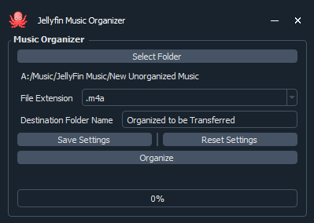

# Jellyfin Music Orgainizer

Jellyfin Music Orgainizer will automatically sort your music into folders that Jellyfin can read

!!! IMPORTANT !!!

It is highly recomended that you create a copy of the music you are orgainizing incase something happens that is unexpected

This will create a folder structure like this below:

/Music
    /Artist
        /Album
            01 - Song.mp3
            02 - Song.mp3

It is important that all your songs have an artist and album name

If not, you can use something like Mp3tag to add them manually

1. Open: Jelllyfin Music Orgainizer.exe
2. Select the folder with your unorgainized music

   1. This program will cut the music from this file location and move/paste it in the destination location
3. Select the file extention of your music files

   1. It will ignore everthing else
   2. If you have multiple different music file extentions you will have to run this multiple times
   3. Supported music file extentions: [".aac", ".aif", ".aiff", ".ape", ".ac3", ".flac", ".m4a", ".mp3", ".mp4", ".mpc", ".mpp", ".ofs", ".ofr", ".ogg", ".tta", ".wav", ".wma", ".wv"]
4. Name the destination folder name if you are not satisfied with the defalt
5. You can save these settings for the future if you want

   1. It will create a json file with folder location, file extention, and destination folder name data
6. When you click Organize, the destination folder will be created in the same place as the Jelllyfin Music Orgainizer.exe
7. It will tell you how many songs it found and the progress bar will update accordingly
8. You can now copy the file system that Jellyfin Music Orgainizer made and paste it into your Jellyfin Media Server music file location

   1. It is a good idea to also copy these files to a local storage location to somewhere like 'Jellyfin Music'
   2. When you do this again in the future all you have to to is:
      1. Put new songs into specific folder to select
      2. Make sure destination folder is empty
      3. Click orgainize
      4. Copy file structure to Jellyfin Media Server and local storage
   3. Duplicate folders coppied over will combine into one
9. Done
