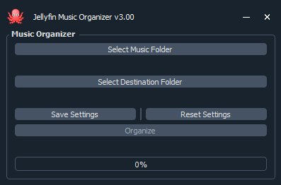
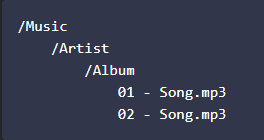
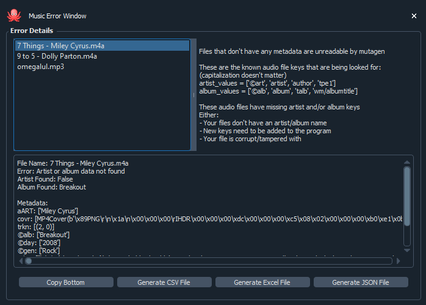

# Jellyfin Music Orgainizer v3.03

Jellyfin Music Orgainizer will automatically sort your music into folders that Jellyfin can read

This will create a folder structure like this below:

It is important that all your songs have an artist and album name

If not, you can use something like Mp3tag to add them manually

If an error occurs or if the audio file doesn't have artist or album name, an error window will open like this below

Hopefully you will never have to see this but, it gives you all the necessary information that you need to diagnose the problem

Also note: you only need to keep the .exe file. The other files are just there to show the code being used.

1. Open: Jelllyfin Music Orgainizer.exe
2. Select the folder with your unorgainized music

   1. This program will copy the music from this file location and paste it in the destination location
   2. This will also look in the subfolders of your selected music folder
   3. Supported music file extentions: [".aif", ".aiff", ".ape", ".flac", ".m4a", ".m4b", ".m4r", ".mp2", ".mp3", ".mp4", ".mpc", ".ogg", ".opus", ".wav", ".wma"]
      1. It will automatically look for every file with these file extentions
3. Select your destination folder. Everything will be saved here
4. You can save these settings for the future if you want (You don't have to save)

   1. It will create a json file with music folder location and destination folder name
5. It will tell you how many songs it found and the progress bar will update accordingly
6. You can now copy the file system that Jellyfin Music Orgainizer made and paste it into your Jellyfin Media Server music file location
7. Done
